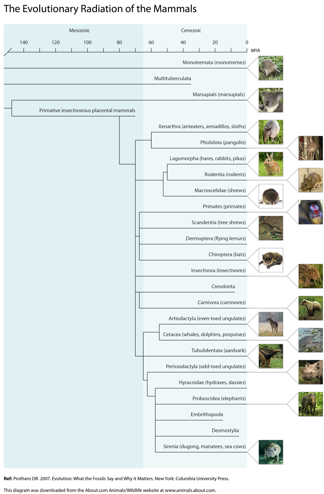

Evolution of Mammals
=====

As a freelance science writer for About.com (now Thought.Co), I was the sole author of their animals and wildlife topic from 2001 until 2016. This wonderful role allowed me to write and publish original content about a wide range of topics that I'm passionate about including animals, wildlife, conservation, evolutionary biology, ecology, and zoological research. 

To accompany my articles, I occasionally designed and created graphics to illustrate complex concepts or to present information in an engaging manner. The following diagram is one such example. I created this diagram using Adobe Illustrator to show the evolutionary relationships between mammal groups:

